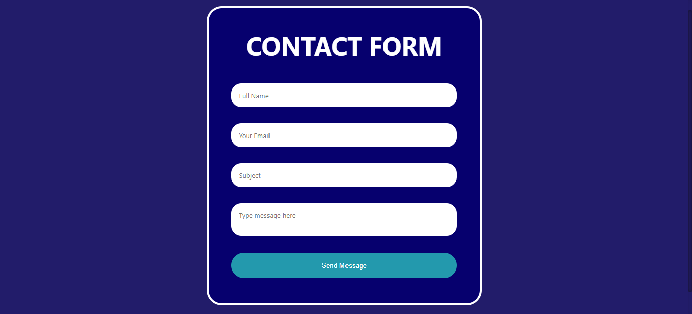
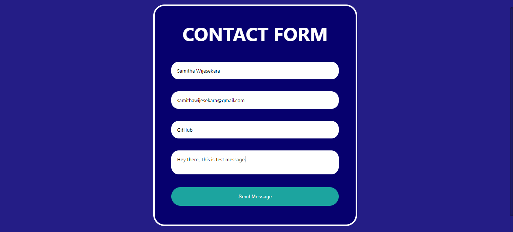

# Contact-Form-with-PHP
Create a simple contact form by using PHP

💻😍 Online Demo : https://glacial-citadel-20263.herokuapp.com/

### Table of Content
-01 [What is this?](#What) 
-02 [For why?](#why) 
-03 [What are the technologies used?](#technologies) 
-04 [How to used this?](#How) 

## What is this?<a name="What"/>
This is a simple contact form by using PHP and mail server. 

## For why?<a name="why"/>
One of the most important reasons to have a contact form on your website is to reduce spam and keep your site secure. When you display your email address on your site, you're more likely to get unwanted emails. That's why most important reasons to have a contact form on your website. 

## What are the technologies used?<a name="technologies"/>
- HTML
- CSS
- PHP

## How to use this?<a name="How"/>

Just filling the form fields and click **send message** button. 

If the message is successfully sent you can see the end of the domain name added text called "mailsend". 

